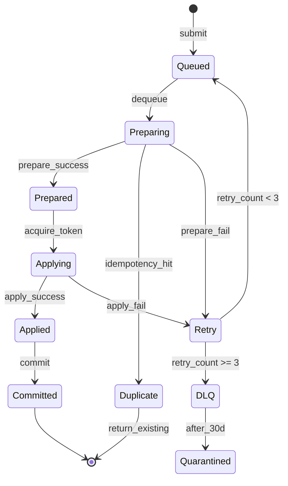

# Execution Layer Semantics Specification

## Overview
The Execution Layer provides deterministic task execution with **at-least-once delivery** and **exactly-once-at-apply** guarantees through a prepare→apply→commit ledger pattern.

## Core Semantics

### 1. Deduplication (Idempotency)
- **Idempotency Key**: Unique identifier per logical operation
- **Idempotency Window**: 24 hours (configurable)
- **Behavior**: Multiple submissions with same key → single execution
- **Storage**: In-memory LRU cache + persistent ledger

### 2. Backpressure
- **Max In-Flight**: 100 tasks per tenant (configurable)
- **Queue Depth**: 10,000 messages per tenant
- **Rejection**: HTTP 429 when limits exceeded
- **Priority Levels**: HIGH (0-3), NORMAL (4-6), LOW (7-9)

### 3. Replay
- **Trigger**: Worker failure, network partition, or manual request
- **Behavior**: Reads existing run manifest to avoid side-effect duplication
- **Manifest Location**: `/runs/{tenant_id}/{run_id}/manifest.json`
- **State Recovery**: From last committed checkpoint

### 4. Dead Letter Queue (DLQ)
- **Max Retries**: 3 attempts with exponential backoff
- **Backoff**: 1s, 4s, 16s (base * 2^retry)
- **Quarantine**: 30 days retention
- **Compensating Actions**: Reference to rollback procedure
- **Manual Intervention**: Required for quarantined items

## Message Attributes

```json
{
  "tenant_id": "string",           // Tenant identifier for isolation
  "idempotency_key": "string",     // Unique operation identifier
  "priority": 0-9,                 // Execution priority (0=highest)
  "retry_count": 0-3,              // Current retry attempt
  "trace_id": "string",             // Distributed trace identifier
  "correlation_id": "string",      // Request correlation
  "submitted_at": "ISO8601",       // Original submission time
  "deadline": "ISO8601",           // Execution deadline (optional)
  "metadata": {                    // Custom attributes
    "source": "string",
    "version": "string",
    "tags": ["string"]
  }
}
```

## State Transitions



## Guarantees

### At-Least-Once Delivery
- Message acknowledgment only after successful commit
- Automatic retry on transient failures
- Visibility timeout prevents concurrent processing

### Exactly-Once-At-Apply
- Prepare phase checks idempotency
- Token-based apply prevents double execution
- Commit phase records completion

### Ordering
- FIFO within priority level per tenant
- No global ordering guarantee
- Sequence numbers for strict ordering (optional)

## Failure Modes

### Network Partition
- **Detection**: Heartbeat timeout (30s)
- **Recovery**: Message redelivery after visibility timeout
- **Prevention**: Idempotency check prevents duplicate apply

### Worker Crash
- **Detection**: Missing heartbeat
- **Recovery**: Message returns to queue
- **Manifest**: Preserves partial progress

### Storage Failure
- **Ledger**: Write-ahead log for recovery
- **Queue**: Persistent backing store
- **Manifests**: S3/object storage with versioning

## Configuration

```yaml
execution:
  queue:
    visibility_timeout: 300s
    max_receive_count: 3
    retention_period: 14d
  
  backpressure:
    max_inflight_per_tenant: 100
    queue_depth_per_tenant: 10000
    
  idempotency:
    window_duration: 24h
    cache_size: 10000
    
  retry:
    max_attempts: 3
    backoff_base: 1s
    backoff_multiplier: 4
    max_backoff: 300s
    
  dlq:
    retention_days: 30
    batch_size: 100
    scan_interval: 1h
```

## Monitoring

### Key Metrics
- `execution.queue.depth{tenant,priority}` - Queue depth by tenant/priority
- `execution.inflight{tenant}` - Active executions per tenant
- `execution.idempotency.hits` - Deduplication rate
- `execution.retries{attempt}` - Retry distribution
- `execution.dlq.entries` - DLQ depth
- `execution.latency{p50,p95,p99}` - E2E latency percentiles

### Alerts
- Queue depth > 1000 for > 5 minutes
- DLQ entries > 100
- Retry rate > 10% of submissions
- Idempotency cache hit rate < 50% (potential issues)