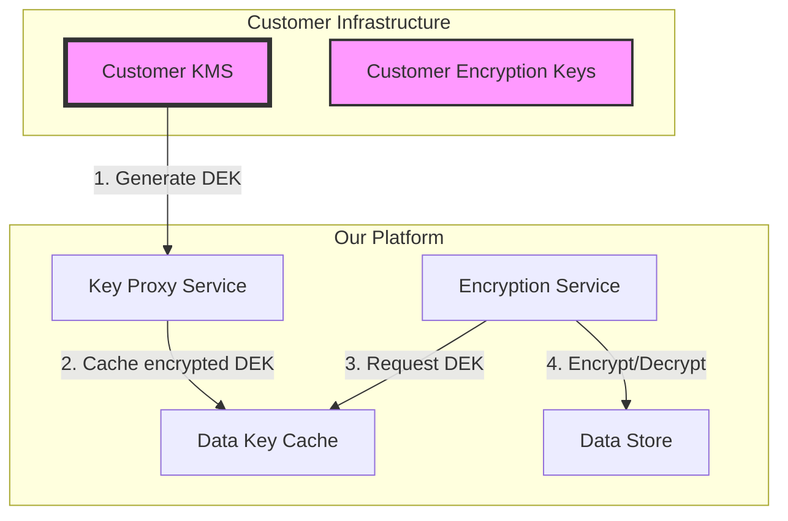

# BYOK (Bring Your Own Key) Implementation Guide

## Overview
This document provides guidance for implementing Bring Your Own Key (BYOK) encryption capabilities, allowing customers to maintain control over their encryption keys while using our services.

## Supported Key Management Systems

### AWS KMS
- **Region Support:** All commercial regions
- **Key Types:** AES-256, RSA-2048/4096
- **Integration Method:** IAM role assumption
- **Rotation:** Automatic annual rotation supported

### Azure Key Vault
- **Region Support:** All Azure regions
- **Key Types:** RSA-HSM, EC-HSM, AES
- **Integration Method:** Managed Identity / Service Principal
- **HSM Support:** Dedicated HSM pools available

### Google Cloud KMS
- **Region Support:** All GCP regions
- **Key Types:** AES-256-GCM, RSA-2048/3072/4096
- **Integration Method:** Service Account with IAM binding
- **External Key Manager:** Supported via EKM

### HashiCorp Vault
- **Deployment:** Self-hosted or HCP Vault
- **Key Types:** AES-256, RSA, ECDSA
- **Integration Method:** AppRole, Kubernetes auth
- **Transit Engine:** Full support for encryption as a service

## Implementation Architecture



## Key Hierarchy

### Master Key (CMK/KEK)
- **Location:** Customer's KMS
- **Purpose:** Encrypt Data Encryption Keys
- **Rotation:** Customer-controlled (recommended annually)
- **Access:** Never leaves customer KMS

### Data Encryption Keys (DEK)
- **Generation:** On-demand per data object/tenant
- **Storage:** Encrypted by CMK, stored in our metadata
- **Lifetime:** Cached for 24 hours, then re-fetched
- **Rotation:** Configurable (default 90 days)

## Setup Process

### Step 1: Customer KMS Configuration

#### AWS KMS Setup
```bash
# Create a Customer Managed Key
aws kms create-key \
  --description "BYOK Master Key for ACME Platform" \
  --key-usage ENCRYPT_DECRYPT \
  --key-spec SYMMETRIC_DEFAULT \
  --multi-region

# Create key policy allowing our service
aws kms put-key-policy \
  --key-id ${KEY_ID} \
  --policy-name default \
  --policy file://key-policy.json
```

**key-policy.json:**
```json
{
  "Version": "2012-10-17",
  "Statement": [
    {
      "Sid": "Enable Customer Account",
      "Effect": "Allow",
      "Principal": {
        "AWS": "arn:aws:iam::CUSTOMER_ACCOUNT:root"
      },
      "Action": "kms:*",
      "Resource": "*"
    },
    {
      "Sid": "Allow Platform Service",
      "Effect": "Allow",
      "Principal": {
        "AWS": "arn:aws:iam::PLATFORM_ACCOUNT:role/byok-service"
      },
      "Action": [
        "kms:Decrypt",
        "kms:GenerateDataKey",
        "kms:CreateGrant"
      ],
      "Resource": "*"
    }
  ]
}
```

#### Azure Key Vault Setup
```powershell
# Create Key Vault
az keyvault create \
  --name "byok-vault-acme" \
  --resource-group "byok-rg" \
  --location "eastus" \
  --sku "premium" \
  --enable-purge-protection

# Create Key
az keyvault key create \
  --vault-name "byok-vault-acme" \
  --name "platform-cmk" \
  --kty RSA-HSM \
  --size 2048 \
  --ops encrypt decrypt wrapKey unwrapKey

# Grant access to platform service principal
az keyvault set-policy \
  --name "byok-vault-acme" \
  --spn ${PLATFORM_SP_ID} \
  --key-permissions get list decrypt unwrapKey
```

### Step 2: Platform Configuration

```yaml
# byok_config.yaml
customer: acme_corp
tenant_id: tenant_12345

encryption:
  provider: "aws_kms"  # aws_kms | azure_kv | gcp_kms | vault
  
  aws_kms:
    key_arn: "arn:aws:kms:us-east-1:123456789:key/abc-123"
    role_arn: "arn:aws:iam::123456789:role/byok-access"
    external_id: "unique-external-id-12345"
    
  key_rotation:
    enabled: true
    interval_days: 90
    
  cache_config:
    ttl_seconds: 86400  # 24 hours
    max_entries: 1000
    
  audit:
    log_all_operations: true
    alert_on_failures: true
```

### Step 3: Validation

```python
#!/usr/bin/env python3
# validate_byok.py

import boto3
from cryptography.fernet import Fernet

def validate_byok_setup(config):
    """Validate BYOK configuration and connectivity"""
    
    # Test KMS connectivity
    kms = boto3.client('kms')
    
    try:
        # Generate a test data key
        response = kms.generate_data_key(
            KeyId=config['key_arn'],
            KeySpec='AES_256'
        )
        
        # Test encryption with the data key
        test_data = b"BYOK validation test"
        f = Fernet(response['Plaintext'][:32])
        encrypted = f.encrypt(test_data)
        decrypted = f.decrypt(encrypted)
        
        assert decrypted == test_data
        print("✓ BYOK setup validated successfully")
        return True
        
    except Exception as e:
        print(f"✗ BYOK validation failed: {e}")
        return False
```

## Operational Procedures

### Key Rotation

#### Customer-Initiated Rotation
```bash
# Notify platform of pending rotation
curl -X POST https://api.platform.com/byok/rotation \
  -H "Authorization: Bearer ${API_TOKEN}" \
  -d '{
    "tenant_id": "tenant_12345",
    "new_key_id": "arn:aws:kms:us-east-1:123456789:key/new-key",
    "rotation_time": "2024-02-01T00:00:00Z",
    "grace_period_hours": 24
  }'
```

#### Automated Rotation Process
```yaml
rotation_workflow:
  - step: "Generate new CMK version"
  - step: "Update platform configuration"
  - step: "Re-encrypt active DEKs"
  - step: "Verify all data accessible"
  - step: "Deactivate old CMK version"
  - step: "Audit and report"
```

### Monitoring & Alerting

```yaml
# monitoring_rules.yaml
byok_monitors:
  - name: "KMS Connectivity"
    metric: "kms_api_success_rate"
    threshold: 99.9
    window: "5m"
    severity: "critical"
    
  - name: "DEK Generation Latency"
    metric: "dek_generation_p99"
    threshold: 1000  # ms
    window: "10m"
    severity: "warning"
    
  - name: "Key Cache Hit Rate"
    metric: "key_cache_hit_ratio"
    threshold: 0.8
    window: "1h"
    severity: "info"
    
  - name: "Failed Decryption Attempts"
    metric: "decrypt_failures_rate"
    threshold: 0.001
    window: "5m"
    severity: "critical"
```

## Security Considerations

### Access Control
- **Principle of Least Privilege:** Grant minimal KMS permissions
- **MFA Requirement:** Enforce MFA for key management operations
- **Network Isolation:** Use PrivateLink/Private Endpoints
- **Audit Logging:** Enable CloudTrail/Azure Monitor/Cloud Audit Logs

### Key Segregation
```yaml
segregation_matrix:
  production:
    key_prefix: "prod-"
    required_tags:
      Environment: "production"
      DataClassification: "sensitive"
    approval_required: true
    
  staging:
    key_prefix: "stage-"
    required_tags:
      Environment: "staging"
    approval_required: false
    
  development:
    key_prefix: "dev-"
    required_tags:
      Environment: "development"
    approval_required: false
```

### Compliance Controls

#### FIPS 140-2 Level 3
- Use HSM-backed keys
- Enable key attestation
- Implement cryptographic module validation

#### PCI DSS
- Implement split knowledge
- Dual control for key management
- Annual key rotation mandatory

#### HIPAA
- BAA required with KMS provider
- Audit all key usage
- Implement key escrow for recovery

## Disaster Recovery

### Key Backup Strategy
```bash
# Backup key metadata (not the key itself)
aws kms describe-key --key-id ${KEY_ID} > key_metadata_backup.json

# Create key replica in another region
aws kms replicate-key \
  --key-id ${KEY_ID} \
  --replica-region us-west-2 \
  --description "DR replica of BYOK master key"
```

### Recovery Procedures
1. **Loss of KMS Access:**
   - Activate DR KMS endpoint
   - Update platform configuration
   - Verify data accessibility

2. **Key Compromise:**
   - Immediately revoke compromised key
   - Generate new CMK
   - Re-encrypt all DEKs
   - Audit for unauthorized access

3. **Regional Outage:**
   - Failover to replica region
   - Update DNS/routing
   - Monitor for split-brain scenarios

## Cost Optimization

### Pricing Considerations
| Operation | AWS KMS | Azure KV | GCP KMS |
|-----------|---------|----------|---------|
| Key Storage | $1/month | $1/month | $0.06/month |
| API Calls | $0.03/10k | $0.03/10k | $0.03/10k |
| HSM Hour | $1.50/hour | $3.50/hour | Custom pricing |

### Optimization Strategies
1. **Cache Aggressively:** Reduce KMS API calls
2. **Batch Operations:** Group key operations
3. **Regional Placement:** Minimize cross-region calls
4. **Right-size HSM:** Use HSM only for critical keys

## Support & Troubleshooting

### Common Issues

#### Issue: "KMS key not accessible"
```bash
# Check IAM permissions
aws kms describe-key --key-id ${KEY_ID}
aws kms get-key-policy --key-id ${KEY_ID}

# Verify network connectivity
nslookup kms.us-east-1.amazonaws.com
traceroute kms.us-east-1.amazonaws.com
```

#### Issue: "Decryption failures"
```python
# Debug script
import logging
logging.basicConfig(level=logging.DEBUG)

# Check key state
key_state = kms.describe_key(KeyId=key_id)['KeyMetadata']['KeyState']
assert key_state == 'Enabled'

# Verify key usage
key_usage = kms.describe_key(KeyId=key_id)['KeyMetadata']['KeyUsage']
assert key_usage == 'ENCRYPT_DECRYPT'
```

### Support Contacts
- **Platform BYOK Team:** byok-support@platform.com
- **Emergency Hotline:** +1-555-BYOK-911
- **Documentation:** https://docs.platform.com/byok
- **Status Page:** https://status.platform.com/byok